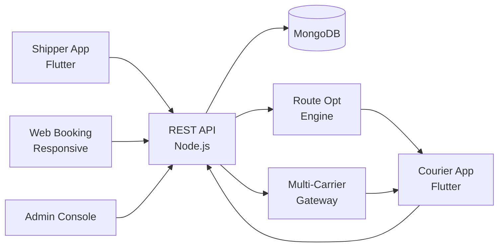

# Fedex Clone — White-Label Last-Mile Logistics & Parcel Delivery Platform by Miracuves

**MXEdex** is a production-ready, white-label Fedex clone: a complete last-mile logistics platform with shipper, courier, and admin panels — delivered with **100% source code ownership** in **6 working days**.

> 🚚 **See it running before you talk to anyone.** Live shipper app, courier app, and admin dashboard — demo credentials are printed on the [solution page](https://miracuves.com/fedex-clone#demo). No sales call required.

---

## 🚀 Live Demos

| Environment | URL | What you can test |
|---|---|---|
| 📱 Shipper App | [mas.mimeld.com](https://mas.mimeld.com) | Schedule pickup, track, pay, RTO |
| 🌐 Web Booking | [mxedex.mimeld.com](https://mxedex.mimeld.com) | Bulk shipping, label printing, analytics |
| 🚚 Courier App | [Solution page → Demo](https://miracuves.com/fedex-clone#demo) | Pickups, routes, deliveries, POD, payouts |
| 🛠️ Admin Console | [Solution page → Demo](https://miracuves.com/fedex-clone#demo) | Couriers, zones, rates, fraud, analytics |

Demo credentials for all environments: **[miracuves.com/fedex-clone → Demo section](https://miracuves.com/fedex-clone/#demo)**

---

## ✨ What Makes This Fedex Clone Different

Most logistics scripts stop at "track a shipment." This platform ships with the features that actually run a delivery *business*:

- **Multi-Carrier Rate Engine** — rate-shop across Delhivery, FedEx, DHL, BlueDart, Shiprocket in 1-second — what customers actually save money on
- **AI Route Optimisation** — route optimization for couriers (20-40% fewer stops per day) — same algorithms FedEx uses
- **Photo + Signature POD** — requires photo at delivery + signature with timestamp — what makes disputes fall in the courier's favor
- **COD Reconciliation** — COD auto-remits to your account with daily settlement — what every Indian shipper needs
- **NDR (Non-Delivery Report) Engine** — AI-triages failed delivery attempts, recommends next action (re-attempt / RTO / reschedule) — same tool Amazon uses

## 📦 Core Features

**Shipper:** schedule pickup · real-time tracking · multi-carrier rates · label printing · COD · insurance · bulk shipping · invoice history

**Courier:** pickup routes · status updates · photo + signature POD · RTO · COD collection · earnings dashboard · payouts

**Admin:** courier onboarding · rate card management · zone management · delivery ops · dispute resolution · analytics

## 🏗️ Architecture

**Stack:** Flutter mobile apps · Node.js backend · MongoDB · Redis for live tracking · multi-carrier API gateway · Stripe for payouts · Stripe, Razorpay, COD reconciliation

## 📋 What’s Included

- ✅ Full source code — backend, web, mobile apps, panels (no encryption, no license locks)
- ✅ Deployment to your servers & app store submission assistance
- ✅ Your branding — white-label rename, logo, colors, domain
- ✅ 60 days post-launch support + 12 months of free updates
- ✅ Documentation & handover

**Pricing:** from **$2,899**, transparent on the [solution page](https://miracuves.com/fedex-clone/#pricing) — no "contact us for quote" games.

## 🆚 Why Not Build From Scratch?

Custom logistics platforms run $80k–$350k and 5–10 months. A proven white-label base gets you to market in 6 working days for a fraction of that, with your budget preserved for carrier API costs and ops.

## 📚 Resources

- 📖 [Fedex Clone — Full Solution Page](https://miracuves.com/fedex-clone) (features, pricing, demos, FAQ)
- 💰 [How Much Does a Logistics App Cost in 2026?](https://miracuves.com/fedex-clone#pricing) pricing breakdown & what's included
- 📝 [Best Fedex Clone Script in 2026](https://miracuves.com/fedex-clone/blog/) features, pricing & launch guide
- 🧠 [NDR Engine: How to Cut Failed-Delivery Rates in Half](https://miracuves.com/fedex-clone/blog/) AI triages, RTO math
- ✅ [Miracuves Facts & Claims Ledger](https://miracuves.com/fedex-clone/facts/) every claim we make, verified

## 🏢 About Miracuves

[Miracuves Solutions](https://miracuves.com) builds white-label clone apps and custom software from Mumbai, India — 90+ ready-made solutions, live demos for every product, transparent pricing, and delivery in 6 working days. Operating since 2010.

**Talk to us:** [WhatsApp](https://wa.me/919830009649) · [Schedule a consultation](https://miracuves.com/schedule-consultation/) · [miracuves.com](https://miracuves.com)

---

### ⚠️ Note on This Repository

This repository is a product overview. The full source code is delivered to clients on purchase — see [what’s included](https://miracuves.com/fedex-clone/#included). For a hands-on evaluation, use the live demos above; credentials are public on the solution page.

*Keywords: fedex clone, fedex clone script, logistics, parcel delivery, courier, white label Shiprocket, multi-carrier shipping, Flutter logistics, Node.js delivery*

---

<!--
══════════════════════════════════════════════════
TEMPLATE VARIABLE KEY — auto-generated from Netflix-Clone pattern
══════════════════════════════════════════════════
{APP_NAME}        Fedex Clone
{MX_NAME}         MXEdex
{CATEGORY}        Last-Mile Logistics & Parcel Delivery Platform
{DEMO_WEB}        mxedex.mimeld.com
{PRICE}           $2,899
{SLUG}            fedex-clone
{SOLUTION_URL}    https://miracuves.com/fedex-clone/
{VERTICAL}        logistics

See /tmp/verticals/logistics.txt for the vertical config used to generate this README.
══════════════════════════════════════════════════
-->